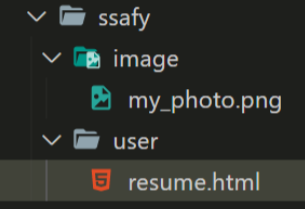
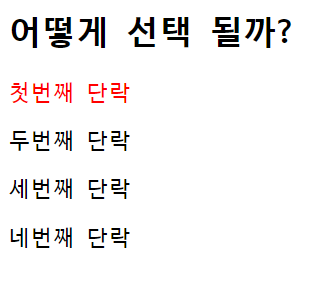
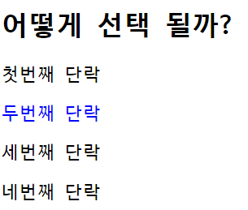

# 21.01.28 Workshop


📚 **공부 내용**

>- HTML
>- CSS


✨ **목표**

> - HTML tag 이해
> - CSS Selector 이해


## 1. img tag

> 아래 그림과 같은 폴더 구조가 있다. 
>
> resume.html에서 코드를 작성 중일 때, image 폴더 안의 my_photo.png를 보여주는<br>`` tag를 작성하시오. - ``태그는 닫는 태그가 필요없다.
>
> 단, 이미지가 제대로 출력되지 않을 때는 ssafy 문자열이 출력 되도록 작성하시오.




---

### 1-1. 나의 답

```html

```


## 2. 파일 경로

> 위와 같이 경로를 __(a)__로 작성 할 시, 
>
> github에 업로드 하거나 전체 폴더의 위치가 변경 되었을 때,이미지를 불러 올 수 없게 된다. 
>
> 이를 해결 하려면 이미지 경로를 __(b)__ 로 바꾸어 작성하면 된다.
>
> 
>
>  __(a)__와 __(b)__에 들어갈 말과 __(b)__ 로 변경한 코드를 작성하시오.

---

### 2-1. 나의 답

(a) : 상대 경로

(b) : 절대 경로

**바꾼 코드**

```html

```


## 3. Hyper Link

> 출력된 my_photo.png 이미지를 클릭하면 ssafy.com으로 이동하도록 하시오.

---

### 3-1. 나의 답

```html
<a href="https://www.ssafy.com">
	
</a>
```


## 4. 선택자

> 1) 아래의 코드를 작성하고 결과를 확인 하시오

```html
<div id="ssafy">
    <h2>어떻게 선택 될까?</h2>
    <p>첫번째 단락</p>
    <p>두번째 단락</p>
    <p>세번째 단락</p>
    <p>네번째 단락</p>
</div>
```

```css
<style>
    #ssafy > p:nth-child(2) {
      color: red;
    }
</style>
```


**브라우저 결과**



why ? `#ssafy > p:nth-child(2)`는 

1. id='ssafy'인 태그의 
2. 자식 (`>` : 자식 결합자) 중 
3. `nth-child(2)` 모든 요소 중 2번째 요소 선택


> 2) nth-child를 nth-of-type으로 변경하고 결과를 확인 하시오

```css
<style>
    #ssafy > p:nth-of-type(2) {
      color: blue;
    }
</style>
```


**브라우저 결과**



why ? `#ssafy > p:nth-of-type(2)`는 

1. id='ssafy'인 태그의 
2. 자식 (`>` : 자식 결합자) 중 
3. `<p>` element 중 2번째 요소 선택


> 3) 작성한 코드를 참고하여 nth-child()와 nth-of-type()의 차이점을 작성하시오

- `부모` > `element:nth-child(n)`<br>:부모 밑에 있는 모든 엘리먼트들을 자식으로 선택해서, n번째를 찾아서 해당 엘리먼트가 맞으면 적용한다.

- `부모 `> `element:nth-of-type(n)`<br>다른 엘리먼트들이 있어도 모두 자식으로 선택되지 않고, 해당하는 엘리먼트만 선택되어 n번째를 찾아서 적용한다.


> 참고

- `:nth-child(N)` : 부모 안에 **모든 요소 중 N번째 요소** 선택
- `A:nth-of-type(N)` : 부모 안에 **`<A>`라는 element 중 N번재 요소** 선택
- `:first-child` : 부모 안에 모든 요소 중 첫번째 요소 선택
- `:last-child` : 부모 안에 모든 요소 중 마지막 요소 선택
- `A:first-of-type` : 부모 안에 `<A>`라는 element 중 첫번째 요소 선택
- `A:last-of-type` : 부모 안에 `<A>`라는 element 중 마지막 요소 선택


