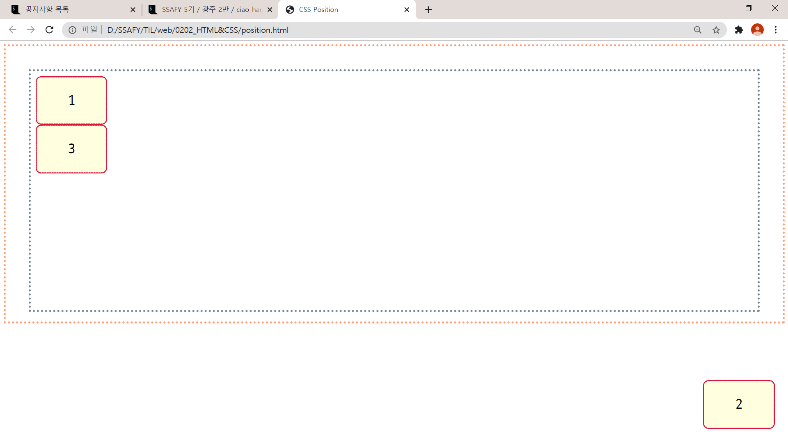

# CSS Position

> CSS Position 요약 (for 광주 2반)

* `position` 속성을 통해 **문서 상에 요소를 배치하는 방법**을 지정한다.

* `top`, `right`, `bottom`, `left` 속성을 통해 **요소의 최종 위치**를 결정한다.

* 사용법은 간단하다.
  1. 기준을 잡는다.  (예- `position: relative;`)
  2. 이동시킨다. (예- `top: 50px;`)

[toc]


---

🎈**알아두기**

> - block
> - inline

**block** : 한 줄 모두 차지 (대표 element -  `<div>`, `<p>` )

**inline** : 콘텐츠 크기 만큼만 차지 (대표 element - `<span>`)

<br>


## 1. Position 속성

> 요소를 옮기려면 일단 위치를 옮길 기준점을 잡는다.

| 값           | 의미                                 |
| ------------ | ------------------------------------ |
| **static**   | 기준 없음 (배치 불가능 / **기본값**) |
| **relative** | 요소 자기 자신을 기준으로 배치       |
| **absolute** | 부모(조상) 요소를 기준으로 배치      |
| **fixed**    | 뷰포트 기준으로 배치                 |
| **stickey**  | 스크롤 영역 기준으로 배치            |


---

### Top, Bottom, Left, Right 속성

> 기준점을 잡았으면 다음 네 가지 속성을 이용해서 요소의 위치를 옮길 수 있다.
>
> 요소의 Position 기준에 맞춰 위쪽, 아래쪽, 왼쪽, 오른쪽에서의 거리를 설정한다.

* top : 요소의 position 기준에 맞는 위쪽에서의 거리(위치)를 설정
* bottom : 요소의 position 기준에 맞는 아래쪽에서의 거리(위치)를 설정
* left : 요소의 position 기준에 맞는 왼쪽에서의 거리(위치)를 설정
* right : 요소의 position 기준에 맞는 오른쪽에서의 거리(위치)를 설정


---

## 1-1. Relative

> 요소를 일반적인 문서 흐름에 따라 배치한다.
>
> **<u>요소 자기 자신의 원래 위치(static일 때의 위치)를 기준</u>으로 배치**한다.
>
> - 원래 위치를 기준으로 위쪽(top), 아래쪽(bottom), 왼쪽(left), 오른쪽(right)에서 얼마만큼 떨어질 지 결정한다.
> - 위치를 이동하면서 다른 요소에 영향을 주지 않는다.
> - 문서 상 원래 위치가 그대로 유지된다.

**💻`html`과 `css` 예시**

```html
<div class="grand-parent">
    <div class="parent">
        <div class="child">1</div>
        <div class="child relative">2</div>
        <div class="child">3</div>
    </div>
</div>
```

```css
.grand-parent {
    /* 박스 스타일링 */
    height: 500px;
    border: 5px dotted lightsalmon;
    /* padding : border와 content사이에 주는 간격 */
    padding: 50px;
}

.parent {
    /* 박스 스타일링 */
    height: 500px;
    border: 5px dotted lightslategray;
    padding: 10px;
}

.child {
    /* 박스 스타일링 */
    width: 150px;
    height: 100px;
    border: 3px dotted crimson;
    border-radius: 12px;
    background-color: lightyellow;

    /* 텍스트 정렬 */
    display: flex;
    justify-content: center;
    align-items: center;
    font-size: 30px;
}

/*  position: relative
-> element가 원래 본인 위치 기준으로 자리를 잡음 */
.relative {
    position: relative;
    left: 100px;
    top: 5px;
}
```

**📺 브라우저 결과 화면**


---


## 1-2. Absolute

> 요소를 일반적인 문서 흐름에서 제거한다.
>
> **<u>가장 가까운 위치에 있는 조상 요소를 기준</u>으로 배치**한다.
>
> - 조상 요소 위치를 기준으로 위쪽(top), 아래쪽(bottom), 왼쪽(left), 오른쪽(right)에서 얼마만큼 떨어질 지 결정한다.
> - 조상 중 Position을 가진 요소가 없다면 초기 컨테이닝 블록(`<body>`요소)를 기준으로 삼는다. (static을 제외한 값)
> - 문서 상 원래 위치를 잃어버린다. (아래에 있는 div가 해당 자리를 차지한다)


다음 html 코드로 아래의 경우들을 확인해보자.

```html
<div class="grand-parent">
    <div class="parent">
        <div class="child">1</div>
        <div class="child absolute">2</div>
        <div class="child">3</div>
    </div>
</div>
```

### 1-2-1. 부모 relative & 자식 absolute

> Parent에게 Position 값이 있는 경우?
>
> - **Parent의 위치를 기준으로 삼는다.**

**🎨 `css` 예시**

```css
.parent {
    /* .. */
    /* .. */

    /*  parent(부모 요소)가 child(자식 요소)의 기준점이 됨 */
    position: relative;
}

/*  position : absolute */
.absolute {
    /* 부모 요소인 parent를 기준으로 위치가 결정된다. */
    position: absolute;
    bottom: 5px;
    right: 5px;
}
```


**📺 브라우저 결과 화면**

- 부모인 안쪽 `<div class="parent">`를 기준으로 삼는다.


---

### 1-2-2. 조상 relative & 자식 absolute

> Grandparent에게 Position 값이 있는 경우?
>
> - **한 단계 올라가서 GrandParent의 Postion값을 찾아서 기준점으로 삼는다.**

**🎨 `css` 예시**

```css
.grand-parent {
    /* .. */
    /* .. */

    /* Grand Parent가 child의 기준점이 됨*/
    position: relative;
}

.parent {
    /* .. */
}

/*  position : absolute */
.absolute {
    /* 부모의 부모 요소인 grand-parent를 기준으로 위치가 결정된다. */
    position: absolute;
    bottom: 0px;
    right: 0px;
}
```


**📺 브라우저 결과 화면**

- 부모의 부모인 바깥쪽 `<div class="grand-parent">`를 기준으로 삼는다.


---

### 1-2-3. 조상 Position 없음 & 자식 absolute

> 부모, 조상 전부 뒤져봐도 Position 값이 없는 경우? (Parent, GrandParent, `<body>`태그, `<html>`태그까지 )
>
> - **window 객체의 viewport를 기준점**으로삼는다. (`DOM` : Document Object Model)

**🎨 `css` 예시**

```css
.grand-parent {
    /* .. */
}

.parent {
    /* .. */
}

/*  position : absolute */
.absolute {
    /* viewport 기준으로 위치가 결정된다. */
    position: absolute;
    bottom: 0px;
    right: 0px;
}
```


**📺 브라우저 결과 화면**

- **`뷰포트 `**를 기준으로 삼는다.


---

## 1-3. Fixed

> **뷰포트를 기준**으로 삼고 싶은 경우?
>
> `absolute`를 사용해서 똑같이 구현할 수 있지만, `absolute`는 조상 요소의 위치를 기준점으로 삼는 개념이므로, 뷰포트를 기준으점으로 삼으려면 `fixed`를 사용한다.

- 요소를 일반적인 문서 흐름에서 제거한다.<br>페이지 레이아웃에 어떠한 공간도 배정하지 않는다.
- 뷰포트를 기준점으로 붙어있다 (== 화면에 붙어있다.)

**💻`html`과 `css` 예시**

```html
<div class="grand-parent">
    <div class="parent">
        <div class="child">1</div>
        <div class="child fixed">2</div>
        <div class="child">3</div>
    </div>
</div>
```

```css
.fixed {
    position: fixed;
    bottom: 30px;
    right: 30px;
}
```


**📺 브라우저 결과 화면**

- 조상 값에 영향을 받지 않고, 화면 기준으로 오른쪽 아래에 위치해 있다.



