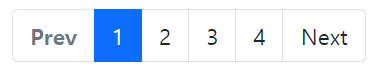
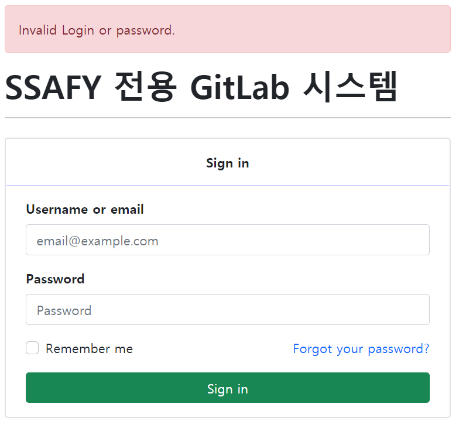

# 21.02.03 Homework


👩‍🦰 **학습해야 할 내용!**

> Bootstrap
>
> Bootstrap Component


[공식 문서](https://getbootstrap.com/docs/5.0/getting-started/introduction/)의 Component를 활용하여 물음에 답하시오.

 1) 각 문항에 제시된 이미지는 현재 lab.ssafy.com에서 사용중인 components이다. 제시된 요소에 사용된 Bootstrap Component가 무엇인지 작성하시오. 

2) 위에서 답한 Bootstrap Component를 사용하여 제시된 요소와 유사한 형태가 되도록 코드를 작성하시오.


## 1.Components

```html
<div class="d-grid gap-2 col-6 mx-auto p-5">
    <button class="btn btn-success" type="button">Sign in</button>
</div>
```


<br>

---

## 2. Components

```html
<nav class="navbar navbar-expand-lg navbar-dark bg-dark">
  <div class="container-fluid">
    <a class="navbar-brand" href="#"></a>
    <div class="collapse navbar-collapse" id="navbarSupportedContent">
      <ul class="navbar-nav me-auto mb-2 mb-lg-0">
        <li class="nav-item dropdown">
          <a class="nav-link dropdown-toggle text-white" href="#" id="navbarDropdown" role="button" data-bs-toggle="dropdown" aria-expanded="false">
            프로젝트
          </a>
          <ul class="dropdown-menu" aria-labelledby="navbarDropdown">
            <!-- <li><a class="dropdown-item" href="#">Action</a></li>
            <li><a class="dropdown-item" href="#">Another action</a></li>
            <li><hr class="dropdown-divider"></li>
            <li><a class="dropdown-item" href="#">Something else here</a></li> -->
          </ul>
        </li>
        <li class="nav-item dropdown">
          <a class="nav-link dropdown-toggle text-white" href="#" id="navbarDropdown" role="button" data-bs-toggle="dropdown" aria-expanded="false">
            그룹툴
          </a>
          <ul class="dropdown-menu" aria-labelledby="navbarDropdown">
          </ul>
        </li>
        <li class="nav-item ms-2">
          <a class="nav-link active" aria-current="page" href="#">활동</a>
        </li>
        <li class="nav-item ms-1">
          <a class="nav-link active" aria-current="page" href="#">마일스톤</a>
        </li>
        <li class="nav-item ms-2">
          <a class="nav-link active" aria-current="page" href="#">스니펫</a>
        </li>
      </ul>
    </div>
  </div>
</nav>
```


<br>

---

## 3. Components

```html
<nav aria-label="Page navigation example">
  <ul class="pagination">
    <li class="page-item disabled"><a class="page-link fw-bold" href="#" tabindex="-1" aria-disabled="true">Prev</a></li>
    <li class="page-item active" aria-current="page"><a class="page-link" href="#">1</a></li>
    <li class="page-item"><a class="page-link text-reset" href="#">2</a></li>
    <li class="page-item"><a class="page-link text-reset" href="#">3</a></li>
    <li class="page-item"><a class="page-link text-reset" href="#">4</a></li>
    <li class="page-item"><a class="page-link text-reset" href="#">Next</a></li>
  </ul>
</nav>
```



<br>

---

## 4. Login Page

```html
<div class="container">
  <div class="row">
    <div class="col-6 m-2">
      <div class="alert alert-danger d-flex flex-row align-items-center" role="alert">
        Invalid Login or password.
      </div>
      <div class="h1 fw-bold">
        SSAFY 전용 GitLab 시스템
      </div>
      <hr class="mb-4">
      <div class="border border-2 rounded">
        <div class="p-3 d-flex justify-content-center">
          <span class="fw-bold">Sign in</span>
        </div>
        <hr class="m-0" style="color: blue">
        <form class="px-4 py-3">
          <div class="mb-3">
            <label for="exampleDropdownFormEmail1" class="form-label fw-bold">Username or email</label>
            <input type="email" class="form-control" id="exampleDropdownFormEmail1" placeholder="email@example.com">
          </div>
          <div class="mb-3">
            <label for="exampleDropdownFormPassword1" class="form-label fw-bold">Password</label>
            <input type="password" class="form-control" id="exampleDropdownFormPassword1" placeholder="Password">
          </div>
          <div class="mb-3 d-flex flex-row justify-content-between">
            <div class="form-check">
              <input type="checkbox" class="form-check-input" id="dropdownCheck">
              <label class="form-check-label" for="dropdownCheck">
                Remember me
              </label>
            </div>
            <a href="#" class="text-decoration-none">Forgot your password?</a>
          </div>
        <div class="d-grid col-12 mx-auto">
            <button class="btn btn-success" type="button">Sign in</button>
        </div>
        </form>
      </div> <!-- box-->
    </div> <!-- col-->
  </div>
</div>
```

