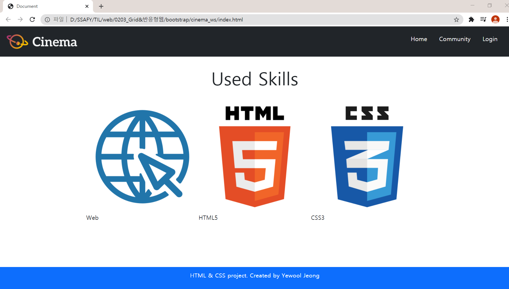

# 21.02.03 Workshop


📚 **공부 내용**

>- Bootstrap


✨ **목표**

> - Bootstrap의 이해
> - Boostrap Component 활용


## 1. Bootstrap Component

> 아래의 페이지를 Bootstrap Class를 활용하여 작성하시오.

1. 각 요소(nav, header, section, footer)는 주어진 코드의 주석에 맞춰 작성합니다. 
2. 모든 이미지 요소는 주어진 이미지 파일을 활용합니다. 
3. 모든 구성 요소 배치는 flexbox를 활용 합니다. 
4. 모든 텍스트 스타일은 공식 문서의 typography를 참고하여 작성합니다.


---

### 1-1. 나의 답


💻 **HTML**

```html
<!DOCTYPE html>
<html lang="ko">
<head>
  <meta charset="UTF-8">
  <meta name="viewport" content="width=device-width, initial-scale=1.0">
  <link rel="stylesheet" href="style.css">
  <title>Document</title>
  <link href="https://cdn.jsdelivr.net/npm/bootstrap@5.0.0-beta1/dist/css/bootstrap.min.css" rel="stylesheet" integrity="sha384-giJF6kkoqNQ00vy+HMDP7azOuL0xtbfIcaT9wjKHr8RbDVddVHyTfAAsrekwKmP1" crossorigin="anonymous">
</head>
<body>
  <!-- 1. Nav -->
  <nav class="fixed-top bg-dark d-flex justify-content-between align-items-center">
    <a href="#" class="ms-2">
      
    </a>
    <ul class="d-flex align-items-center justify-content-between me-3 list-unstyled nav-list">
      <li><a href="#" class="text-decoration-none text-light px-3">Home</a></li>
      <li><a href="#" class="text-decoration-none text-light px-3">Community</a></li>
      <li><a href="#" class="text-decoration-none text-light px-3">Login</a></li>
    </ul>
  </nav>

  <!-- 2. Header -->
  <header class="d-flex flex-column align-items-center justify-content-center">
      <div class="text-white display-1 fw-bold">Cinema</div>
      <div class="text-white display-1 fw-bold">Community</div>
      <a href="#" class="btn btn-primary btn-lg mt-5">Let's Go</a>
  </header>

  <!-- 3. Section-->
  <section class="d-flex flex-nowrap flex-column align-items-center mt-5">
    <h2>Used Skills</h2>
    <article class="d-flex flex-row justify-content-round mt-4">
      <div class="d-flex flex-nowrap flex-column justify-content-center align-content-aroundr">
        
        <p>Web</p>
      </div>
      <div class="d-flex flex-nowrap flex-column justify-content-center align-content-around">
        
        <p>HTML5</p>
      </div>
      <div class="d-flex flex-nowrap flex-column justify-content-center align-content-around">
        
        <p>CSS3</p>
      </div>
    </article>
  </section>

  <!-- 4. Footer -->
  <footer class="fixed-bottom d-flex justify-content-center align-items-center bg-primary">
    <p class="text-white">HTML & CSS project. Created by Yewool Jeong</p>
  </footer>
  
  <script src="https://cdn.jsdelivr.net/npm/bootstrap@5.0.0-beta1/dist/js/bootstrap.bundle.min.js" integrity="sha384-ygbV9kiqUc6oa4msXn9868pTtWMgiQaeYH7/t7LECLbyPA2x65Kgf80OJFdroafW" crossorigin="anonymous"></script>

</body>
</html>

```

<br>

🎨 **CSS**

```css
@import url('https://fonts.googleapis.com/css?family=Noto+Sans+KR');

/* 아래의 코드는 수정하지 마세요. */
body {
  height: 3000px;
  margin: 0;
  font-family: 'Noto Sans KR', sans-serif;
}

nav {
  height: 80px;
  width: 100%;
}

nav img {
  height: 80px;
}

header {
  height: 700px;
  background-image: url('images/header.jpg');
  background-size: cover;
}

section > h2 {
  font-size: 3rem;
}

section img {
  width: 300px;
}

footer {
  height: 60px;
}


/* 추가적으로 작성하고 싶은 순수 CSS 코드가 있다면 해당 주석 아래에 작성해 주세요. */

/*  왜 안 되지? */
.nav-list a:hover {
  color: orange;
} 

```

<br>

📺 **브라우저 결과 화면**





session > article > div > p 가 justify-content-around가 안먹힌다 ㅠㅠ

내일 수업 듣고 수정해봐야겠다.