# 21.02.04 Workshop


📚 **공부 내용**

>- Bootstrap Grid System
>- Bootstrap Responsive Web


✨ **목표**

> - Grid System의 활용
> - Responsive Web(반응형 웹)의 이해


<br>

## 1. 기본 그리드 레이아웃

> 각 문항의 지시에 따라 **01_grid.html** 파일에 정답을 작성하시오


---

### 1-1. 나의 답

> 1. 제시된 3개의 컬럼이 container를 가득 채우도록 클래스를 추가 작성하시오. <br>단, 각 컬럼의 너비는 동일하도록 작성하시오. 

```html
<div class="row p-0">
    <div class="item">
        <p>4개</p>
    </div>
    <div class="item">
        <p>4개</p>
    </div>
    <div class="item">
        <p>4개</p>
    </div>
    <div class="item">
        <p>4개</p>
    </div>
</div>
```

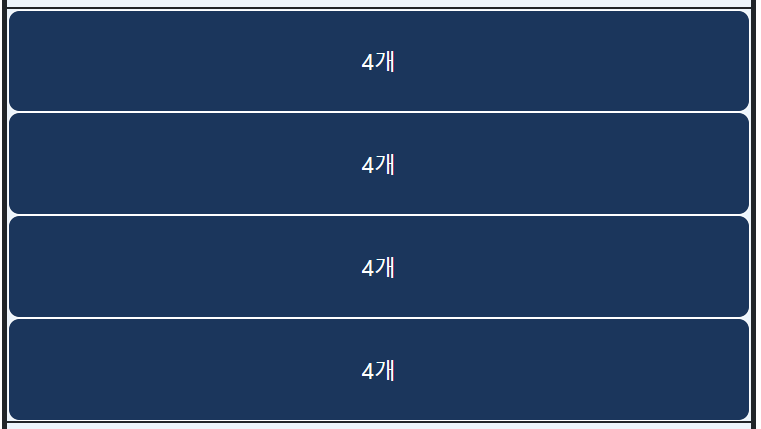

<br>

> 2.  제시된 2개의 컬럼이 container를 가득 채우도록 클래스를 변경하시오.<br>단, 각 컬럼의 너비는 동일하도록 작성하시오. 

```html
<div class="row p-0">
    <div class="item col-6">
        <p>6개</p>
    </div>
    <div class="item col-6">
        <p>6개</p>
    </div>   
</div>
```


<br>

> 제시된 12개의 컬럼이 3칸, 6칸, 3칸씩 차지하도록 마크업과 클래스를 변경하시오. 

```html
<div class="row p-0">
    <div class="item col-3">
        <p>3개</p>
    </div>  
    <div class="item col-6">
        <p>6개</p>
    </div>
    <div class="item col-3">
        <p>3개</p>
    </div>
</div> 
```

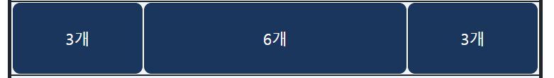

<br>

> 제시된 3개의 컬럼이 2칸, 7칸, 3칸씩 차지하도록 클래스를 변경하시오

```html
<div class="row p-0">
    <div class="item col-2">
        <p>2개</p>
    </div>
    <div class="item col-7">
        <p>7개</p>
    </div>
    <div class="item col-3">
        <p>4개</p>
    </div> 
</div>
```


> 공통적으로 적용된 CSS

```css
@import url('https://fonts.googleapis.com/css?family=Baloo+2&display=swap');

body {
  font-family: 'Baloo 2', cursive;
  font-size: 1.2rem;
}

/* 1~3번 문제 */
h1 {
  text-align: center;
}

.container {
  margin-top: 3rem;
  margin-bottom: 3rem;
  border: 3px solid;
  border-radius: 0.3rem;
  background: #6fa4ed;
}

.container > .row {
  padding-top: 1.5rem;
  padding-bottom: 1.5rem;
}

.row {
  background: #edf5fc;
  border: 1px solid;
}

.item {
    text-align: center;
    padding-top: 1.5rem;
    padding-bottom: 1.5rem;
    color: white;
    border: 1px solid;
    border-radius: 8px;
    background: #1b365c;
}

.item > p {
  margin: 0;
}

```


<br>

**📚 공부 정리 !**

| Extra small |  Small  | Medium  |  Large  | X-Large  | XX-Large |
| :---------: | :-----: | :-----: | :-----: | :------: | :------: |
|   < 576px   | ≥ 576px | ≥ 768px | ≥ 992px | ≥ 1200px | ≥ 1400px |
|     `-`     |  `sm`   |  `md`   |  `lg`   |   `xl`   |  `xxl`   |

<br>

---

## 2. 반응형 그리드

> 각 문항의 지시에 따라 **02_grid.html** 파일에 정답을 작성하시오.

---

### 2-1. 나의 답

>1. Viewport 너비가 576px 미만인 경우, 각 컬럼이 4칸, 4칸, 4칸씩 차지하고 576px 이상인 경우, 2칸, 5칸, 5칸씩 차지하도록 클래스를 추가하시오. 

```html
<div class="row">
        <div class="item col-4 col-sm-2">
            <p>576px 미만 4 <br> 576px 이상 2</p>
        </div>
        <div class="item col-4 col-sm-5">
            <p>576px 미만 4 <br> 576px 이상 5</p>
        </div>
        <div class="item col-4 col-sm-5">
            <p>576px 미만 4 <br> 576px 이상 5</p>
        </div>
</div>

```

- **576px 미만 (sm)**인 경우,
- 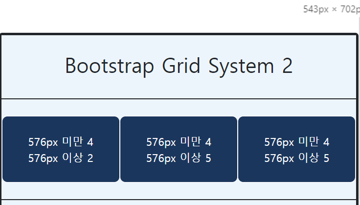
- 이상인 경우,
- 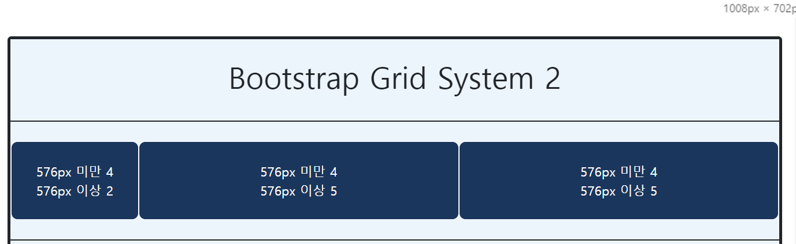

<br>

> 2. Viewport 너비가 768px 미만인 경우, 각 컬럼이 1칸, 3칸, 4칸, 1칸, 3칸씩 차지하고 768px 이상인 경우, 2칸, 3칸, 3칸, 2칸, 2칸씩 차지하도록 클래스를 추가하시오.

```html
<div class="row">
    <div class="item col-1 col-md-2">
        <p>768px 미만 1 <br> 768px 이상 2</p>
    </div>
    <div class="item col-3 col-md-3">
        <p>768px 미만 3 <br> 768px 이상 3</p>
    </div>
    <div class="item col-4 col-md-3">
        <p>768px 미만 4 <br> 768px 이상 3</p>
    </div>
    <div class="item col-1 col-md-2">
        <p>768px 미만 1 <br> 768px 이상 2</p>
    </div>
    <div class="item col-3 col-md-2">
        <p>768px 미만 3 <br> 768px 이상 2</p>
    </div>
</div>
```

- **768px - md** 미만인 경우
- 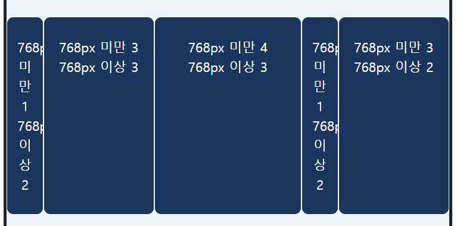
- 이상인 경우
- 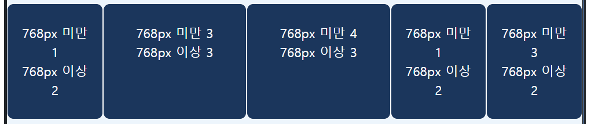

<br>

> 3. Viewport 너비가 576px 미만인 경우, 각 컬럼이 4칸, 6칸, 2칸씩 차지하고 576px 이상인 경우, 3칸, 3칸, 6칸씩 차지하며 768px 이상인 경우, 6칸, 6칸, 12칸을 차지하도록 클래스를 추가하시오. 

```html
<div class="row">
    <div class="item col-4 col-md-3 col-lg-6">
        <p>576px 미만 4 <br> 768px 미만 3 <br> 768px 이상 6</p>
    </div>
    <div class="item col-6 col-md-3 col-lg-6">
        <p>576px 미만 6 <br> 768px 미만 3 <br> 768px 이상 6</p>
    </div>
    <div class="item col-2 col-md-6 col-lg-12">
        <p>576px 미만 2 <br> 768px 미만 6 <br> 768px 이상 12</p>
    </div>
</div>
```

- 576px 미만
- 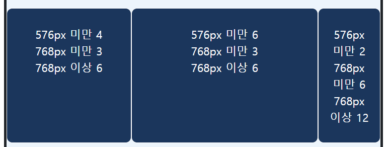
- 768px 미만
- 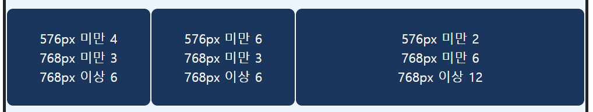
- 768px 이상
- 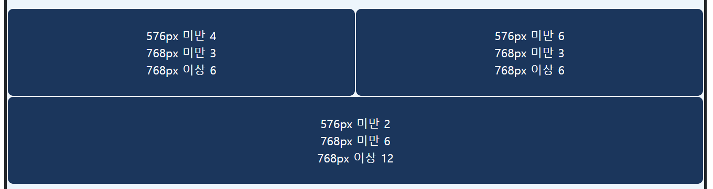

<br>

> 4. Viewport 너비가 768px 미만인, 경우 각 컬럼이 12칸, 12칸, 12칸씩 차지하고 768px 이상인 경우, 4칸, 4칸. 4칸씩 차지하며 1200px 이상인 경우, 2칸, 2칸씩 차지하고 12칸을 차지하는 컬럼이 그 다음에 내려오도록 클래스를 추가하시오.

```html
<div class="row">
    <div class="item col-12 col-md-4 col-xl-2">
        <p>768px 미만 12 <br> 768px 이상 4 <br> 1200px 이상 2</p>
    </div>
    <div class="item col-12 col-md-4 col-xl-2">
        <p>768px 미만 12 <br> 768px 이상 4 <br> 1200px 이상 2</p>
    </div>
    <div class="item col-12 col-md-4 col-xl-12">
        <p>768px 미만 12 <br> 768px 이상 4 <br> 1200px 이상 12</p>
    </div>
</div>
```

- 768px 미만
- 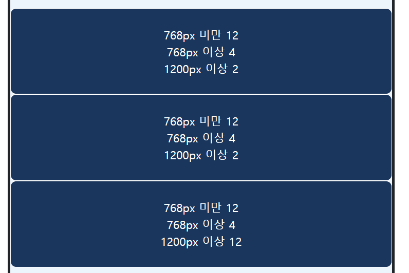
- 768px 이상, 1200px 미만
- 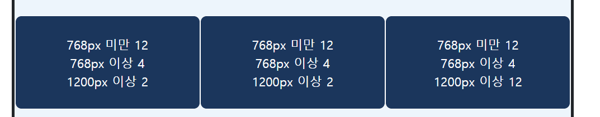

- **1200px - xl** 이상인 경우
- 

<br>

---

## 3. 그리드 심화

> 각 문항의 지시에 따라 **03_grid.html** 파일에 정답을 작성하되, offset 클래스를 적절한 상황에 사용하여 작성하시오.

---

### 3-1. 나의 답

> 1. Viewport가 768px 미만인 경우, 각 컬럼이 4칸, 8칸씩 차지하도록 하고, 768px 이상인 경우, 각 컬럼이 4칸, 4칸을 양 끝에서 차지하며 가운데 4칸의 빈 공간이 생기도록 클래스를 추가하시오.

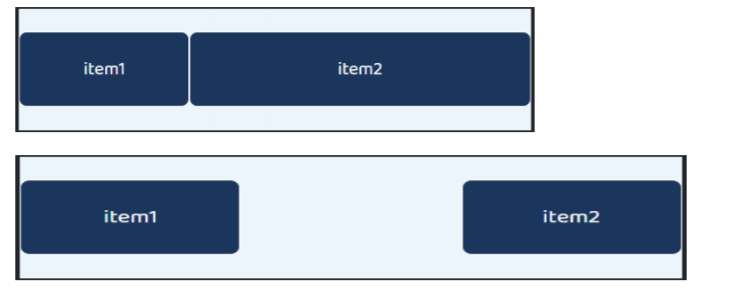

```html
<div class="row">
    <div class="item col-4 col-md-4">
        <p>item1</p>
    </div>
    <div class="item col-8 col-md-4 offset-md-4">
        <p>item2</p>
    </div>
</div>
```


> 2. Viewport가 768px 미만인 경우, 각 컬럼이 4칸, 4칸을 양 끝에서 차지하며 가운데 4칸의 빈 공간이 생기도록 하고, 992px 미만인 경우, 4칸의 빈 공간이 앞에 있고 4칸, 4칸의 컬럼이 뒤쪽에 위치하며 992px 이상인 경우, 앞에 7칸의 빈 공간이 있고 뒤에 5칸의 공간을 차지하는 컬럼과 그 아래 줄에 앞뒤 2칸의 빈 공간 사이에 8 칸을 차지하는 컬럼이 위치하도록 클래스를 추가하시오.

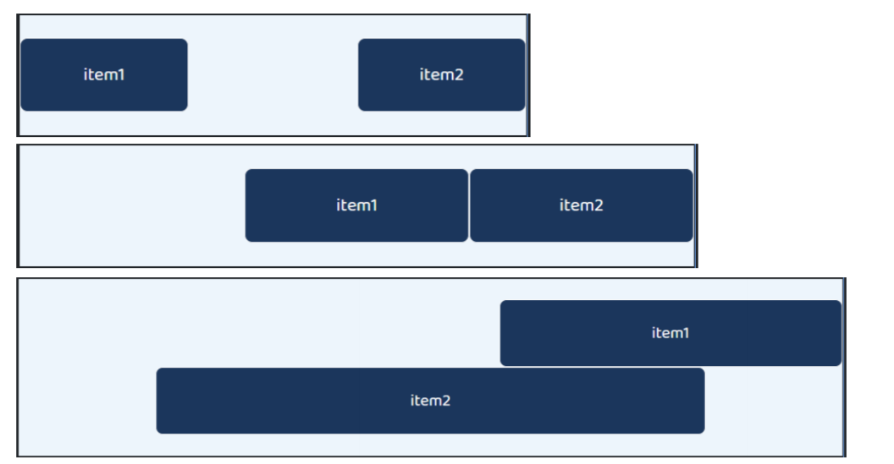

```html
<div class="row">
    <div class="item col-4 col-md-4">
        <p>item1</p>
    </div>
    <div class="item col-8 col-md-4 offset-md-4">
        <p>item2</p>
    </div>
</div>
```


> 3. 1) 주어진 조건에 부합하도록 코드를 작성하시오. Viewport 너비가 768px 미만인 경우, item1은 12칸을 차지하도록 하고 4개의 item을 감싸고 있는 박스는 12칸, 박스 내부의 item2, item3, item4, item5는 박스 너비를 12칸으로 보았을 때 각각 6칸씩 차지하도록 작성하시오.

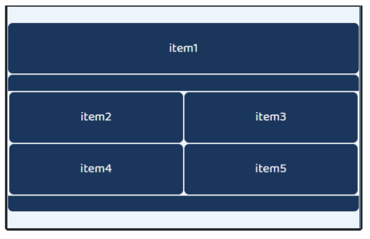

>3. 2) Viewport 너비가 768px 이상 992px 미만인 경우, item1은 3칸을 차지하도록 하고 4개의 item을 감싸고 있는 박스는 9칸, 박스 내부의 item2, item3, item4, item5는 박스 너비를 12칸으로 보았을 때 각각 6칸씩 차지하도록 작성하시오

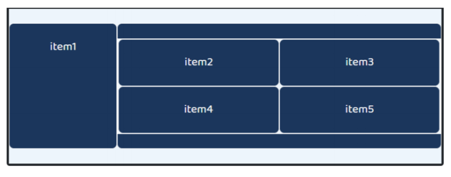

> 5. Viewport 너비가 992px 이상인 경우, item1은 3칸을 차지하도록 하고 4개의 item을 감싸고 있는 박스는 9칸, 박스 내부의 item2, item3, item4, item5는 박스 너비를 12칸으로 보았을 때 각각 3칸씩 차지하도록 작성하시오.

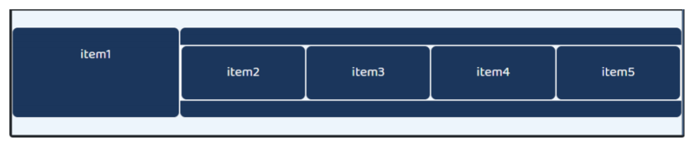

```html
<!-- 1 -->
<div class="row">
    <div class="item col-4 col-md-4">
        <p>item1</p>
    </div>
    <div class="item col-8 col-md-4 offset-md-4">
        <p>item2</p>
    </div>
</div>

<!-- 2 -->
<div class="row">
    <div class="item col-4 offset-md-4 col-md-4 offset-lg-7 col-lg-5">
        <p>item1</p>
    </div>
    <div class="item col-4 offset-4 offset-md-0 col-md-4 offset-lg-2 col-lg-8">
        <p>item2</p>
    </div>
</div>


<!-- 3, 4, 5 -->
<div class="row">
    <div class="item col-12 col-md-3 col-xl-3">
        item1
    </div>
    <div class="item col-12 col-md-9 col-xl-9">
        <div class="row">
            <div class="item col-6 col-md-6 col-xl-3">item2</div>
            <div class="item col-6 col-md-6 col-xl-3">item3</div>
            <div class="item col-6 col-md-6 col-xl-3">item4</div>
            <div class="item col-6 col-md-6 col-xl-3">item5</div>
        </div>
    </div>
</div>
```

