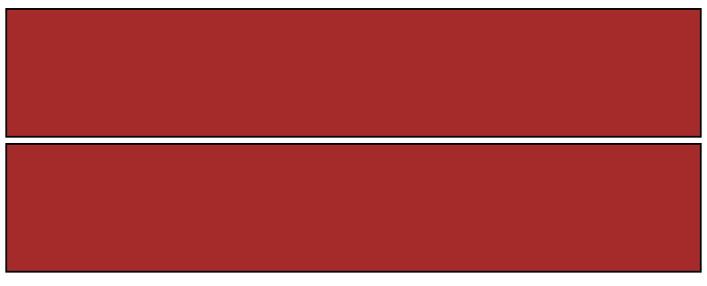
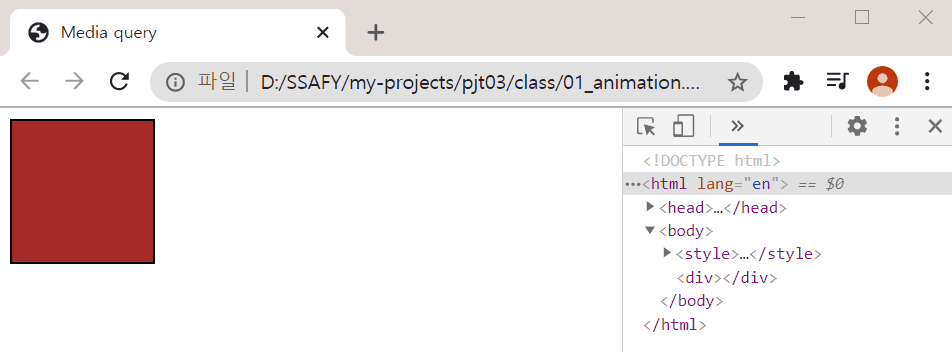
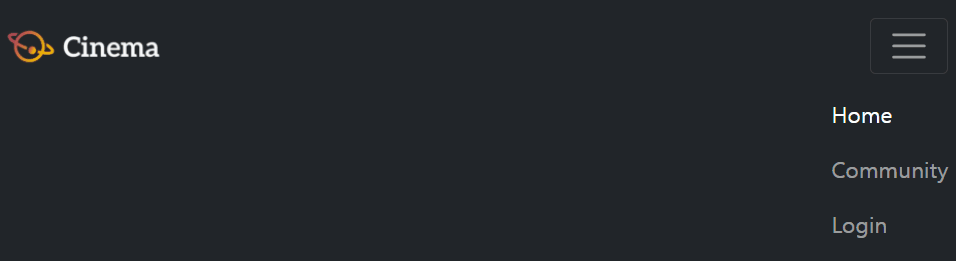
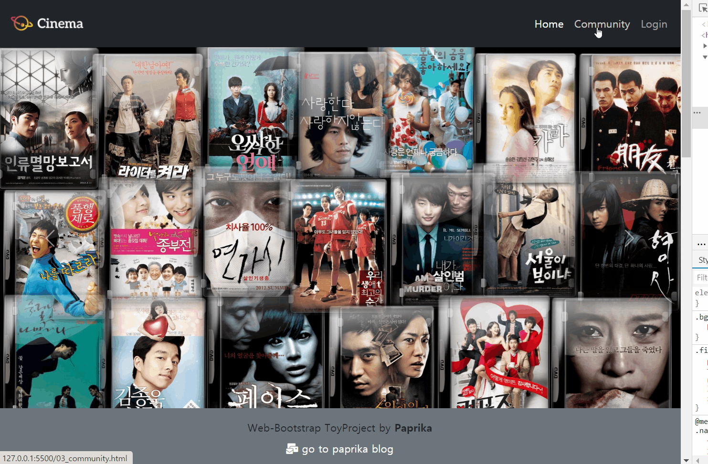

# PROJECT 03 (21.02.05)


## 📘 **오늘의 프로젝트 주제**

>Bootstrap 프레임워크 기반 웹 페이지 구현

💻 **프로젝트 실행환경**

> **개발 언어 : html, css**
>
> > 개발 도구
> >
> > 1. Visual Studio Code
> > 2. Google Chrome Browser
> > 3. Bootstrap v5.0 
>
> 

👊 **프로젝트 목표**

1. Bootstrap 프레임워크를 활용해서,
2.  자유자재로 커스터마이징하여 요구사항에 맞게 변형할 수 있다!
3. `grid` , `layout`, `position`,  `flex`, `component` 등을 자유롭게 활용하고 응용해보자!

<br>

---

### 📗 공부한 내용

<br>

### [ 반응형 웹 (responsive web) ]

<br>

### 1. 미디어 쿼리

> 반응형 디자인의 핵심 구성 요소!
>
> ~~부트스트랩이 더 간단하기 때문에 참고용으로 알고있자~~

**[ 기본 구성 ]**

```css
@media media-type and (media-feature-rule) {
    /* CSS rules go here*/
}
```

미디어 쿼리 구문의 구성 요소 :

- 여기 코드가 어떤 미디어를 위한 것인지 브라우저에 알려주는 미디어 유형 (예를 들어, 인쇄 또는 화면)
- 괄호로 묶은 CSS 규칙이 적용되기 위해 전달되어야 하는 규칙 또는 조건문 격인 미디어 표현식
- 조건문을 통과하고 미디어 유형이 올바른 경우 적용되는 CSS  규칙 집합


**[ 간단 예제 ]**

**🎨 css**

```css
/*  screen에서 (대부분 웹에서 보는 것이라 생략해도 괜찮다)
        width:768px 이상인 경우, (그 미만는 적용 X) 
        color를 red로 바꿔라 */
@media screen and (min-width:768px){
    body {
        color : red;
    }
}
```


**💻 html**

```html
<h1>안녕하세요</h1>
```

<br>


**🌏 브라우저 결과 화면**

- 768px 미만일 때


- 768px 이상일 때


> 위 미디어 쿼리는 부트스트랩의 `col-md` class를 적용했을 때와 동일한 조건으로 작동한다.

---

#### 1-1. Media Query vs Bootstrap

>  반응형 웹을 구현할 때, 미디어쿼리와 부트스트랩을 각각 비교해서 확인해보자

- Media Query

  ```css
  div {
      border: 2px solid black;
      background-color: brown;
      width: 100px; height: 100px;
      display: inline-block;
  }
  
  @media (max-width: 576px) {
      div {
          width: 100%;
      }
  }
  
  @media (max-width: 768px) and (min-width: 576px) {
      div {
          width: 40%;
      }
  }
  
  @media (max-width: 992px) and (min-width: 768px) {
      div {
          width: 10%;
      }
  }
  ```


- Bootstrap (상세 %와 column은 조금의 차이가 있을 수 있습니다.)

  ```html
  <div class="container">
      <div class="row">
          <div class="box col-12 col-md-8 col-lg-2"></div>
          <div class="box col-12 col-md-8 col-lg-2"></div>
      </div>  
  </div>
  ```


**🌏 브라우저 결과 화면**

- 576px 미만일 때 - sm인 상태 (박스 크기 각 100%)



- 576px 이상 + 768px 미만일 때 - md 상태 (박스 크기 각 40%)


- 768px  이상 + 992px 미만일 때 - md 상태 (박스 크기 각 10%)


---

#### 1-2. 미디어쿼리에 애니메이션 적용

> `@keyframes (동작)` 을 이용한다

**🎨 css**

```css
div {
    border: 2px solid black;
    background-color: brown;
    width: 100px; height: 100px;
    display: inline-block;
    animation: move, color-change;
    animation-duration: 3s;
}

@keyframes move {
    0% {
        margin-left: 0px;
    }
    100% {
        margin-left: 200px;
    }
}

@keyframes color-change {
    from {
        background-color: brown;
    }
    to {
        background-color: cadetblue;  
    }
}
```


**🌏 브라우저 결과 화면**



---


### 2. 접근성 (Accessibility)

> 가능한 한 많은 사람이 웹 사이트를 사용할 수 있도록 하는 방법으로, 통상적으로 장애인만을 대상으로 한다고 생각하지만 실제로는 모바일 장치를 사용하는 사람이나 느린 네트워크 연결을 사용하는 사람들도 포함하고 있다!

접근성을 모든 사람을 동일하게 대하고, 그들의 능력이나 상황에 상관 없이 **모두에게 같은 접근 권한을 주는 것**으로 생각할 수 있다. 휠체어에 있기 때문에 누군가를 물리적 건물에서 제외시키는 것이 옳지 않은 것과 같이 (공공 건물에는 일반적으로 휠체어 경사로나 엘리베이터가 있기 때문에), 휴대 전화를 사용하지 않는 사람을 웹 사이트에서 제외시키는 것도 옳지 않다. 

접근성은 당연히 지켜져야 할 일이지만 일부 국가에서는 법의 일부이기도 하며, 서비스 사용이나 제품 구매가 불가능했던 사람들을 불러모아 중요한 소비자들로 만들 수 있다!


**📖 자세한 설명**

[접근성 관련 MDN 설명](https://developer.mozilla.org/ko/docs/Learn/%EC%A0%91%EA%B7%BC%EC%84%B1/What_is_accessibility)


> 예전에 팟캐스트 '아궁이'에서 접근성에 대한 이야기를 처음으로 접해보았는데, 그 때 굉장히 나는 차마 신경쓰지 못했던 부분들까지 고려하며 프로그래밍을 해야 한다는 것을 배울 수 있었다. 
>
> 단순한 노인, 시각 장애인이나 청각 장애인 뿐 아니라, 저시력, 색맹, 인지 손상(cognitive impairments) 을 겪고 있는 사람 등 내가 기존에 생각했던 것보다 더 넓은 범위의 사람들이 웹 사이트를 이용함에 불편함을 겪을 수 있다는 것을 알 수 있었다.


네이버에서는 접근성에 대한 가이드 라인을 제공하고 있다.

[NULI](https://nuli.navercorp.com/)


<br>

---

## 👩‍💻 본격 프로젝트 시작!


**요구사항**

> 커뮤니티 서비스 개발을 위한 화면 구성 단계로, 
>
> 유저가 보는 프론트엔드를 개발합니다.

---

### ✨ 1. 첫 번째 미션! 


#### > `01_nav_footer.html`

##### 1-1. 네비게이션 바(Navigation Bar)

> 1. 네비게이션 바는 스크롤을 하더라도 항상 상단에 고정되어 있습니다. 
> 2. 로고 이미지는 images 폴더 안의 logo.png파일을 사용합니다. 
> 3. 로고 이미지는 클릭이 가능한 링크이며, 해당 페이지(02_home.html)로 이동해야 합니다. 
> 4. 네비게이션 바 내부의 네비게이션 리스트(Home, Community, Login)는 ul 과 li 요소를 사용합니다. 
> 5. 네비게이션 바 내부의 네비게이션 리스트(Home, Community, Login)는 오른쪽에 배치합니다. 
> 6. 네비게이션 리스트의 각 항목들은 클릭이 가능한 링크이며, 해당 페이지 (02_home.html, 03_community.html, #)로 이동해야 합니다. 
> 7. 네비게이션 리스트(Home, Community, Login)의 항목들 중에서 Home을 강조합 니다. 
> 8. 네비게이션 리스트의 Login 항목은 클릭 시 요소가 Modal 컴포넌트를 통하여 나타납니다.(페이지 이동이 일어나지 않습니다.) 
> 9. Modal 컴포넌트 내부에는 form 요소를 배치합니다. 
> 10. Modal 컴포넌트에서 form요소 내부의 비밀번호는 표시되지 않습니다. 
> 11. Viewport의 가로 크기가 768px 미만일 경우에는 네비게이션 리스트(Home, Community, Login)가 햄버거 버튼으로 교체되며, 클릭했을 시 세부 항목을 볼 수 있습니다.

<br>

##### 1-2. 푸터 (Footer)

> 1. 푸터는 스크롤을 하더라도 항상 하단에 고정되어 있습니다. 
> 2. 푸터에 작성된 내용은 수평으로 정렬되어 있습니다. (왼쪽, 오른쪽 여백이 같습니 다.) 
> 3. 푸터에 작성된 내용의 빈 부분(`_____`)은 본인의 이름을 작성합니다. 
> 4. 위에 명시된 내용 이외에는 자유롭게 작성합니다.


하다보니 navbar에서 각 양 끝에 로고와 네비게이션 리스트(home, community, login)을 배치하는 게 잘 되지 않았다.

구조가 `<nav>` 의 `<div>` 밑에 `<a>`(로고-home),  `<button>`(햄버거 메뉴 버튼),  `<div>`(내비게이션 리스트) 이렇게 세 개가 있어서 그런 것 같았다.

그래서 `<div>` 내비게이션 리스트에  `d-flex justify-content-end`를 주었을 때, 큰 화면에서는 괜찮았는데, 768px 미만일 때 햄버거 버튼과 함께 표시될 때는 아래와 같은 문제가 발생했다.



이렇게 토글이 접히지 않는다.. 이를 해결하기 위해서 교수님께 도움을 요청했다.😥


문제는 바로!

bootstrap의 `<nav>`의 navbar class 자체에 `display: flex` 속성이 이미 내장되어있어, 내가 그 하위 요소들에 `d-flex` 속성을 주면 두 번 적힌 게 되어서 충돌이 발생하는 것이다. 아마 css 폴더에 따로 만들어서 작성을 한다면 문제가 되지 않았을 텐데 bootstrap 클래스는 모두 `!important`로 들어가기 때문에 충돌 문제가 발생한 것 같다. 

그래서  `<div>` 내비게이션 리스트에  `d-flex`는 넣지 않고 `justify-content-end`만 추가해주어 문제가 해결되었다! 🎉 

<br>

예전 프로젝트 때 처음 써보았던 [FontAwesome](https://fontawesome.com/)에서 아이콘도 가져와보았다.

처음에 네모박스로 나와서 왜 안 되나 했더니 유료 아이콘을 가져와서 그런 거였다..😅 

다시 free 에서 찾아봐서 추가했다. 


**🎨 CSS**

```css
.home-logo-img {
  width: 120px;
}
```


**💻 HTML** (핵심 부분만!)

- navigation bar 부분

```html
<!-- navigation bar -->
<nav class="fixed-top navbar navbar-expand-md navbar-dark bg-dark">
    <div class="container-fluid">
        <!-- logo -->
        <a class="navbar-brand" href="02_home.html"></a>
        <!-- toggle btn -->
        <button class="navbar-toggler" type="button" data-bs-toggle="collapse" data-bs-target="#navbarNav" aria-controls="navbarNav" aria-expanded="false" aria-label="Toggle navigation">
            <span class="navbar-toggler-icon"></span>
        </button>
        <!-- nav list -->
        <div class="collapse navbar-collapse justify-content-end" id="navbarNav">
            <ul class="navbar-nav">
                <li class="nav-item">
                    <a class="nav-link active" aria-current="page" href="02_home.html">Home</a>
                </li>
                <li class="nav-item">
                    <a class="nav-link" href="03_community.html">Community</a>
                </li>
                <li class="nav-item">
                    <a class="nav-link" href="#loginModal" data-bs-toggle="modal">Login</a>
                </li>
            </ul>
        </div>
    </div>
</nav>
```


- modal 부분

```html
<!-- Modal (login form) -->
<div class="modal fade" id="loginModal" tabindex="-1" aria-labelledby="loginModalLabel" aria-hidden="true">
    <div class="modal-dialog">
        <div class="modal-content">
            <!-- Modal Heaer -->
            <div class="modal-header">
                <h5 class="modal-title fw-bold" id="loginModalLabel">Login</h5>
                <button type="button" class="btn-close" data-bs-dismiss="modal" aria-label="Close"></button>
            </div>
            <!-- Modal Body (FORM) -->
            <div class="modal-body">
                <form class="row g-3 d-flex flex-column">
                    <div>
                        <label for="inputUserName" class="form-label">UserName</label>
                        <input type="email" class="form-control" id="inputUserName" placeholder="Enter your email">
                    </div>
                    <div class="mb-2">
                        <label for="inputPassword" class="form-label">Password</label>
                        <input type="password" class="form-control" id="inputPassword" placeholder="Enter your password">
                    </div>

                    <div>
                        <div class="form-check">
                            <input class="form-check-input" type="checkbox" id="gridCheck">
                            <label class="form-check-label" for="gridCheck">
                                Check me out
                            </label>
                        </div>
                    </div>

                </form>
            </div>
            <!-- Modal Footer -->
            <div class="modal-footer">
                <button type="button" class="btn btn-secondary" data-bs-dismiss="modal">Close</button>
                <button type="button" class="btn btn-primary">Submit</button>
            </div>
        </div>
    </div>
</div>
```


- footer 부분

```html
<footer class="fixed-bottom d-flex flex-column justify-content-center align-items-center py-3 bg-secondary">
    <sapn>Web-Bootstrap ToyProject by <strong>Paprika</strong></sapn>
    <a href="https://creamilk88.tistory.com/" class="text-decoration-none mt-2 text-white"><i class="fas fa-mail-bulk"></i> go to paprika blog</a>
</footer>
```


**🌏 브라우저 결과 화면**


---

### ✨ 2. 두 번째 미션! 


####  > `02_home.html`

##### 2-1. 네비게이션 바(Navigation Bar)

> 1. 네비게이션 리스트(Home, Community, Login)의 항목들 중에서 Home을 강조합니다. 
> 2. Home 페이지는 크게 상단 Header와 하단 Section요소로 이루어져 있습니다.

 ##### 2-2. Header 

> 1. Header는 이미지는 최소 3장이며, 자동으로 전환됩니다. 이미지는 자유롭게 선 택합니다. (images/폴더 안의 header 이미지들을 사용해도 됩니다.) 

##### 2-3. Section 

> 1. Section 내부의 개별 요소(article)들은 이미지, 제목, 설명을 포함하며 각 요소 (article)들은 좌우 일정한 간격으로 떨어져 있습니다. (간격은 자유롭게 설정 가 능하며 images/폴더 안의 movie 이미지들을 사용해도 됩니다.) 
> 2. Section 내부의 요소(article)들은 Viewport의 가로 크기가 576px미만일 경우에는 한 열(row)에 1개씩 표시됩니다. 
> 3. Section 내부의 요소(article)들은 Viewport의 가로 크기가 576px이상일 경우에는 한 열(row)에 2개 이상 자유롭게 표시합니다. 
> 4. 위에 명시된 내용 이외에는 자유롭게 작성합니다.


후.. 처음에 영화 소개 카드를 하나하나 직접 만들다가 그리드 만들고, 띄우고, 이미지 꽉 채우다가 ..

결국 카드 사이 간격 margin을 줬을 경우, 줄 바꿈 현상으로 인해 card-layout을 부트스트랩에서 많이 인용해서 가져왔다.

부트스트랩이 정말 편한거구나..ㅎㅎㅎ


**🎨 CSS**

```css
section {
  margin-bottom: 100px;
  padding:0px;
}

article {
  border:solid lightgrey 1px;
  padding-bottom: 2px;
}

.card-title {
  text-align: center;
  font-weight: bold;
}
```


**💻 HTML**

- Header 부분 - `Carosel` 활용

```html
<header class="header">
    <div id="carouselExampleControls" class="carousel slide" data-bs-ride="carousel">
        <ol class="carousel-indicators">
            <li data-bs-target="#carouselExampleIndicators" data-bs-slide-to="0" class="active"></li>
            <li data-bs-target="#carouselExampleIndicators" data-bs-slide-to="1"></li>
            <li data-bs-target="#carouselExampleIndicators" data-bs-slide-to="2"></li>
        </ol>
        <div class="carousel-inner">
            <div class="carousel-item active">
                
            </div>
            <div class="carousel-item">
                
            </div>
            <div class="carousel-item">
                
            </div>
        </div>
        <a class="carousel-control-prev" href="#carouselExampleControls" role="button" data-bs-slide="prev">
            <span class="carousel-control-prev-icon" aria-hidden="true"></span>
            <span class="visually-hidden">Previous</span>
        </a>
        <a class="carousel-control-next" href="#carouselExampleControls" role="button" data-bs-slide="next">
            <span class="carousel-control-next-icon" aria-hidden="true"></span>
            <span class="visually-hidden">Next</span>
        </a>
    </div>
</header>
```


- Section 부분 - `card-laytout` 활용

```html
<div class="container">
    <section class="row row-cols-1 row-cols-sm-2 row-cols-md-3 g-2">
        <div class="col">
            <article class="card">
                <div class="card-body">
                    <h5 class="card-title">Movie title</h5>
                    <p class="card-text">This is a longer card with supporting text below as a natural lead-in to additional content. This content is a little bit longer.</p>
                </div>
            </article>
        </div>
        <div class="col">
            <article class="card">
                <div class="card-body">
                    <h5 class="card-title">Movie title</h5>
                    <p class="card-text">This is a longer card with supporting text below as a natural lead-in to additional content. This content is a little bit longer.</p>
                </div>
            </article>
        </div>
        <div class="col">
            <article class="card">
                <div class="card-body">
                    <h5 class="card-title">Movie title</h5>
                    <p class="card-text">This is a longer card with supporting text below as a natural lead-in to additional content. This content is a little bit longer.</p>
                </div>
            </article>
        </div>
        <div class="col">
            <article class="card">
                <div class="card-body">
                    <h5 class="card-title">Movie title</h5>
                    <p class="card-text">This is a longer card with supporting text below as a natural lead-in to additional content. This content is a little bit longer.</p>
                </div>
            </article>
        </div>
        <div class="col">
            <article class="card">
                <div class="card-body">
                    <h5 class="card-title">Movie title</h5>
                    <p class="card-text">This is a longer card with supporting text below as a natural lead-in to additional content. This content is a little bit longer.</p>
                </div>
            </article>
        </div>
        <div class="col">
            <article class="card">
                <div class="card-body">
                    <h5 class="card-title">Movie title</h5>
                    <p class="card-text">This is a longer card with supporting text below as a natural lead-in to additional content. This content is a little bit longer.</p>
                </div>
            </article>
        </div>
    </section>
</div><!-- container-->
```


**🌏 브라우저 결과 화면**


---

### ✨ 3. 세 번째 미션! 


#### > `03_community.html`

##### 3-1. 네비게이션 바(Navigation Bar)

> 1. 네비게이션 리스트(Home, Community, Login)의 항목들 중에서 Community를 강조합니다. 
> 2. Community 페이지는 크게 게시판 목록, 게시판으로 이루어져 있습니다.
> 3. 게시판 목록과 게시판은 div.main 요소로 둘러쌓여 있습니다.

 ##### 3-2. 게시판 목록

> 1. 게시판 목록은 aside 요소로 이루어져 있습니다. 
> 2. 게시판 목록 내부의 각 항목들(Boxoffice, Movies, Genres, Actors)은 ul과 li 요소를 사용합니다. 
> 3. 게시판 목록 내부의 각 항목들은 클릭이 가능한 링크이며, 모두 동작은 하지 않습니다. 
> 4. Viewport의 가로 크기가 992px 이상일 경우에는 게시판 목록 내부의 항 목들(Boxoffice, Movies, Genres, Actors)은 div.main영역의 내부에서 좌측 1/6 만큼의 너비를 가집니다. 
> 5. Viewport의 가로 크기가 992px 미만일 경우에는 게시판 목록 내부의 항 목들(Boxoffice, Movies, Genres, Actors)은 div.main영역의 내부에서 전체만 큼의 너비를 가집니다

##### 3-3. 게시판 

> 1. 게시판은 Viewport의 가로크기에 따라 전혀 다른 요소를 표시합니다. 
> 2.  Viewport의 가로 크기가 992px 이상일 경우에는 게시글들이 표(table)요 소로 표시되며, div.main영역의 내부에서 우측 5/6 만큼의 너비를 가집니 다. 
> 3. Viewport의 가로 크기가 992px 미만일 경우에는 게시글들이 글(article)요 소들의 집합으로 표시되며, div.main영역의 내부에서 전체만큼의 너비를 가집니다. 
> 4. 게시글은 글 제목, 영화 제목, 사용자 id, 작성시간으로 구성되어 있으며 해당 구성을 유지해야 합니다. 
> 5. 테스트 게시글의 개수는 2개 이상으로 자유롭게 구성할 수 있습니다. 
> 6. 게시판 탐색기(paginator)는 게시판 아래에 위치하며, 게시판과 같은 가로 폭을 가집니다. 
> 7. 게시판 탐색기(paginator)는 자신의 영역 안에서 좌우 중앙 정렬되어 있 습니다. 
> 8. 게시판 탐색기(paginator) 내부의 요소들은 클릭이 가능한 링크이며, 모두 동작은 하지 않습니다. 


**🎨 CSS**

```css
/* 03_community.css */
/* 아래에 코드를 작성해 주세요. */

.main {
  margin-top: 72px;
  margin-bottom: 100px;
}

h1 {
  padding-top: 40px; padding-bottom:40px;
  text-align: center;
  font-weight: bold;
}

.list-group-item {
  text-align: center;
}

.posting-title {
  float:left;
  font-size: 17px;
}

.movie-title, .register-time {
  float: left;
}

.writer {
  float: right;
}
```


**💻 HTML**

```html
<!-- Sidebar : 게시판 목록 -->
<div class="container">
    <div class="row">
        <aside class="col-12 col-lg-2">
            <ul class="list-group list-group-flush">
                <li class="list-group-item list-group-item-action">BoxOffice</li>
                <!-- 중략-->
            </ul>
        </aside>


        <!-- Board : 게시판 -->
        <!-- 1) table -->
        <section class="col-12 col-lg-10">
            <div class="d-none d-lg-block">
                <table class="table table-striped"> 
                    <thead>
                        <tr class="table-dark">
                            <!--중략-->
                        </tr>
                    </thead>
                    <tbody>
                        <tr>
                            <th scope="row">Movie title</th>
                            <td>BEST Movie EVER!</td>
                            <td>milk</td>
                            <td>1 minutes ago</td>
                        </tr>
                        <!-- 중략 -->
                    </tbody>
                </table>
            </div>
        </section>

        <!-- 2) list -->
        <article class="col-12">
            <div class="d-block d-lg-none">
                <hr class="m-3">
                <ul class="list-group list-group-flush">
                    <li class="list-group-item">
                        <!-- 중략-->
                    </li>
                </ul>
                <hr class="m-3">
            </div>
        </article>

    </div> <!-- row -->
```


**🌏 브라우저 결과 화면**



뷰포트 크기에 따라서 같은 내용을 어떻게 보여줄 지, 선택해야 하는 것이 어려웠다.

부트스트랩에서는 `d-(size)-none`, `d-(size)-block` 기능을 통해 이를 설정해주는 것이 있었다. 하 아직도 사이즈 개념이 헷갈린다.

하다보면 익숙해지겠지?


---


## 👍 배운 점

> 이번 프로젝트에서 이렇게나 많은 것들을 배울 수 있었다!

- 접근성 (Accessibility)을 배우며, 프로그래밍을 할 때, 더 많은 사람들이 편하게 사용할 수 있는 서비스를 만드는 것이 중요성을 배울 수 있었다. 이 때 많은 복잡한 것들을 고려할 수도 있겠지만, 내가 할 수 있는 것들도 많다. 예를 들어 ``에서 `alt`속성을 좀 더 자세히 적는 것, `시맨틱 태그`를 적극 활용하는 것 등 내가 지금부터 접근성을 고려한 프로그래밍을 하는 습관을 들이는 것이 중요하다는 것을 느꼈다! 
- 그동안은 부트스트랩을 그저 긁어와서 각 class의 속성을 몰라서, 커스터마이징 할 때 크게 어려웠는데, 이번 주에 css 및 부트스트랩의 속성에 대해서 잘 배워서 내가 부트스트랩을 보다 주체적으로 사용할 수 있게 되어서 프론트엔드에 조금이나마 자신감이 생겼다!
- 내가 부트스트랩 클래스를 잘 이용해서, 구조도 잘 맞게 짰는데 자꾸 문제가 발생한다! 하면 나를 의심하지 말고 부트스트랩을 의심해보자. 크롬의 개발자도구를 통해 조정하고자 하는 요소에 클릭해보면, 부트스트랩 자체에 내장되어있는 property와 내가 기재한 attribute가 충돌될 수 있다. 잘 확인해보고 적용하자! - 부트스트랩이 거의 우선되기 때문에, 내가 쓴 게 무시될 수 있다.
- 온라인으로 페어 프로그래밍을 통해 프로젝트를 진행하는데, 직접 소통하지 못해 아쉽지만 오히려 화면 공유가 쉬워 더 효율적인 측면이 있다는 것을 세 번째의 프로젝트 때 깨달았다! 오늘도 팀원들에게 많은 도움을 받아 완성할 수 있었다! 🥰